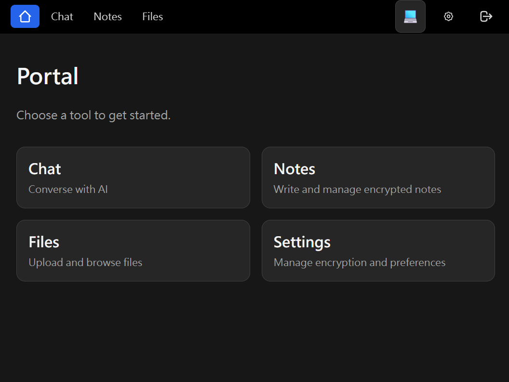

# Toolkits GCP

Secure, single‑service application for Chat, Notes, and Files on Google Cloud. Toolkits combines a FastAPI backend and a React + Tailwind frontend with end‑to‑end encryption (AES‑GCM) and JWT (HS256) authentication. Deploys as a single App Engine service.

## Features
- JWT auth (HS256) with access/refresh tokens.
- AES‑GCM request/response encryption using `encrypted_data` payloads.
- Chat with streaming responses (SSE responses are not encrypted).
- Encrypted Notes: create, edit, list with server‑side encryption.
- Files on GCS: upload (file/URL), list, rename, delete, download, toggle public/private.
- Single App Engine deployment serving both API and static frontend.

## Repository Structure
- `backend/` FastAPI app, middleware, routers, services.
- `frontend/` React + Tailwind app (Create React App).
- `app.yaml` App Engine service config (serves `frontend/build` and proxies API).
- `PRD.md`, `DESIGN.md`, `PLAN.md` product and technical docs.

## Quick Start

Prerequisites
- Python 3.13 (local 3.11+ works), Node.js 18+, npm
- gcloud CLI configured for your project
- A GCS bucket for file storage

1) Backend
- Create and populate `backend/.env` (see `backend/.env.example`). Add/confirm:
  - `GOOGLE_API_KEY`, `GOOGLE_CLOUD_PROJECT`, `GCS_BUCKET`
  - `JWT_SECRET_KEY`, `USERNAME`, `PASSWORD_HASH`, `JWT_ACCESS_EXPIRE_MINUTES`, `JWT_REFRESH_EXPIRE_DAYS`
  - `AES_KEY_HASH` (required for encryption)
- Install deps and run the API:
  - `python -m venv .venv && . .venv/bin/activate` (PowerShell: `.venv\Scripts\Activate`)
  - `pip install -r requirements.txt`
  - `uvicorn backend.main:app --reload`

2) Frontend
- In `frontend/`, set the API base URL (Create React App):
  - Create `frontend/.env` with `REACT_APP_API_URL=http://localhost:8000`
- Install deps and start dev server:
  - `npm ci`
  - `npm start`

3) Sign In and Encryption
- Sign in with `USERNAME` and the password that matches `PASSWORD_HASH`.
- Open the Settings page to configure the AES key hash (`localStorage.aes_key_hash`) used for encrypting/decrypting payloads.

## Configuration

Environment variables
- Auth: `JWT_SECRET_KEY`, `USERNAME`, `PASSWORD_HASH`, `JWT_ACCESS_EXPIRE_MINUTES`, `JWT_REFRESH_EXPIRE_DAYS`
- Encryption: `AES_KEY_HASH`
- GCP: `GOOGLE_CLOUD_PROJECT`, `GCS_BUCKET`, `GOOGLE_API_KEY`
- Optional: `AUTH_RATE_LIMIT`, `CHAT_RATE_LIMIT`, `DEBUG`

Frontend
- `REACT_APP_API_URL` points the UI at your backend (e.g., `http://localhost:8000`).
- The frontend stores the AES key hash in `localStorage.aes_key_hash`.

## API Overview
- Auth: `POST /auth/login`, `POST /auth/refresh`, `POST /auth/logout`, `GET /auth/me`
- Chat: `/api/chat`, `/api/conversations` (SSE is unencrypted by design)
- Notes: `/api/notes` (CRUD; payloads use `encrypted_data`)
- Files: `/api/files` operations plus `upload`, `download`, `toggle-share`
- Encryption wire format: JSON `{ "encrypted_data": "..." }`

See `PRD.md:1`, `DESIGN.md:1`, `PLAN.md:1` for details.

## Testing
- Backend unit tests: from repo root run `pytest -q`
- Keep tests fast and focused; see `backend/tests`.

## Deployment (App Engine)
- Build the frontend so `frontend/build` exists:
  - `cd frontend && npm ci && npm run build`
- Deploy the service from repo root:
  - `gcloud app deploy`
- Ensure required env vars are set in App Engine (see `app.yaml` and the variables above).

## Security Notes
- Do not log secrets; configure through environment variables only.
- SSE responses (chat streaming) must remain unencrypted.
- AES‑GCM server key is derived from `AES_KEY_HASH`; the frontend key hash lives in `localStorage.aes_key_hash`.

## Contributing
- Use clear, typed API contracts and keep changes minimal.
- Follow existing Python and React/Tailwind patterns.
- Update or add adjacent unit tests when modifying routers/services.
- Before significant changes, coordinate via `DESIGN.md` and `PLAN.md`.

## License
No license file is included. If you intend to open‑source this project, add a license (e.g., MIT or Apache‑2.0).

## References
- Product Requirements: `PRD.md:1`
- Technical Design: `DESIGN.md:1`
- Implementation Plan: `PLAN.md:1`
- App Engine Config: `app.yaml:1`

